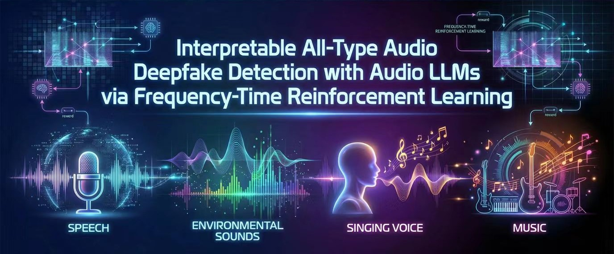

# Interpretable All-Type Audio Deepfake Detection with Audio LLMs via Frequency–Time Reinforcement Learning

  
  &nbsp;
  
  &nbsp;

  <b>Note:</b> The data and code will be released in approximately two weeks.

  

This is the official repository of our work  
**“Interpretable All-Type Audio Deepfake Detection with Audio LLMs via Frequency–Time Reinforcement Learning”**.

