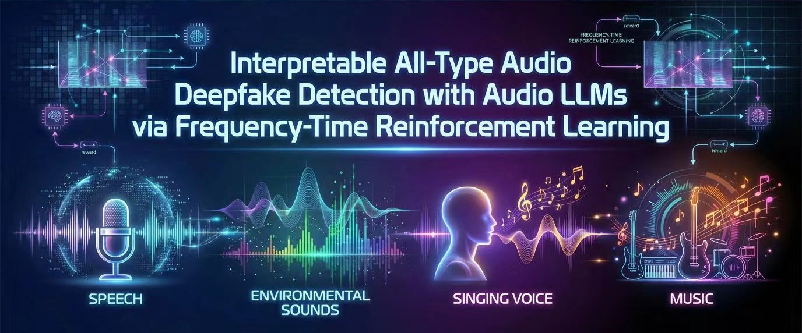

# Interpretable All-Type Audio Deepfake Detection with Audio LLMs via Frequency–Time Reinforcement Learning

<p align="center">
  <a href="https://xieyuankun.github.io/FT-GRPO/">
    
  </a>
  &nbsp;
  <a href="https://arxiv.org/abs/2601.02983">
    
  </a>
  &nbsp;

</p>


<p align="center">
  
</p>

This is the official repository of our work  
**“Interpretable All-Type Audio Deepfake Detection with Audio LLMs via Frequency–Time Reinforcement Learning”**.


## 1. Data Preparation
This project requires downloading four datasets independently.

Speech - [ASVspoof2019](https://datashare.ed.ac.uk/handle/10283/3336)

Sound - [ESDD_train&dev](https://zenodo.org/records/16684355)，[ESDD_eval](https://zenodo.org/records/16685039)

Singing Voice - [CtrSVDD_train&dev](https://zenodo.org/records/10467648), [CtrSVDD_eval](https://zenodo.org/records/12703261)

Music - [FakeMusicCaps](https://zenodo.org/records/15063698)

All label - [Training & Testing](https://huggingface.co/datasets/xieyuankun/FT-GRPO/tree/main)

Upon downloading all datasets, please arrange them in accordance with the directory structure outlined below. 

```
# Project Directory Structure

## ASVspoof2019 Dataset
│   ├── ASVspoof2019
│   │   ├── LA
│   │   │   ├── ASVspoof2019_LA_train
│   │   │   │   └── flac
│   │   │   │        └── *.flac (25,380 audio files)
│   │   │   ├── ASVspoof2019_LA_dev
│   │   │   │   └── flac
│   │   │   │        └── *.flac (24,844 audio files)
│   │   │   ├── ASVspoof2019_LA_eval
│   │   │   │   └── flac
│   │   │   │        └── *.flac (71,237 audio files)

## CtrSVDD Dataset
│   ├── CtrSVDD
│   │   ├── train
│   │   │   └── *.wav (84,404 audio files)
│   │   ├── dev
│   │   │   └── *.wav (43,625 audio files)
│   │   ├── eval
│   │   │   └── *.wav (92,769 audio files)

## Fakemusiccaps Dataset
│   ├── Fakemusiccaps
│   │   ├── audio
│   │   │   └── *.wav (33,041 audio files)


## ESDD Dataset
│   ├── dev
│   │   ├── real_audio
│   │   │   └── *.wav (35,753 audio files)
│   │   ├── fake_audio
│   │   │   └── *.wav (143,012 audio files)
│   ├── test_track1_2
│   │   ├── test_track1
│   │   │   └── *.wav (4,000 audio files) 
```
The above file directory is provided for reference only. For the actual loading path, please refer to the JSON file of label. Please match the paths in JSON with your own local file paths. All paths in the JSON file have been anonymized as `“yourpath”`.

## 2. Environment Setup
```
conda create -n add python==3.10.13
pip install -r requirements.txt
```

## 3. ALLM Preparation

All ALLMs are based on **Hugging Face** models.  
Please download the required ALLM checkpoints locally before training.

```
huggingface-cli download Qwen/Qwen2.5-Omni-3B --local-dir yourpath/huggingface/Qwen2.5-Omni-3B
```

## 4. FT-GRPO Training
### Step 1：SFT cold start
Update the `--model` path in the script to your local ALLM directory, then run:
```
bash script/train_sft_s1.sh
```
Identify the best checkpoint by reviewing logging.jsonl in the checkpoint directory, then merge the weights:

```
bash script/merge_lora.sh
```

### Step 2 GRPO
Replace the `--model` path in the script with the merged checkpoint directory obtained from the previous step, then start the GRPO training:
```
bash script/train_grpo_s2.sh
```
## 5. Evaluation
Use the following command to sequentially evaluate the model across the four different test sets:
```
bash script/test.sh
```
After obtaining result.jsonl, compute the ACC by comparing the <answer> field in each line with the corresponding ground-truth label:

```
python script/eval_grpo.py
```

## 6. Other Experiments （real/fake SFT）
We provide the training script for binary_sft used in the paper, along with the corresponding [labels](https://huggingface.co/datasets/xieyuankun/FT-GRPO/tree/main/binary-SFT). You may refer to these resources to conduct training. For evaluation, simply use the same testing script in `script/test.sh`.
```
bash script/binary_sft.sh
```


## 🙏 Acknowledgements

We would like to express our sincere gratitude to the [ms-swift](https://github.com/modelscope/swift) framework. Its efficient fine-tuning and reinforcement learning capabilities were instrumental in the development and optimization of this project.


## 📝 Citation

If you find this repository is useful to your research, please cite it as follows:
```
@article{xie2026interpretable,
  title={Interpretable All-Type Audio Deepfake Detection with Audio LLMs via Frequency-Time Reinforcement Learning},
  author={Xie, Yuankun and Guo, Xiaoxuan and Zhou, Jiayi and Wang, Tao and Liu, Jian and Fu, Ruibo and Wang, Xiaopeng and Cheng, Haonan and Ye, Long},
  journal={arXiv preprint arXiv:2601.02983},
  year={2026}
}
```